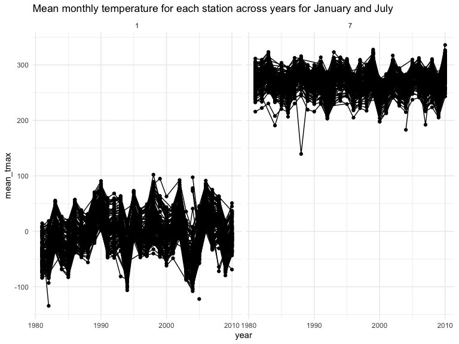
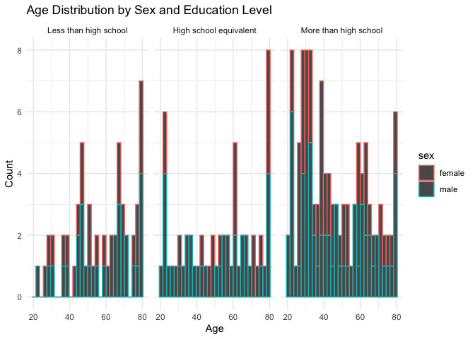
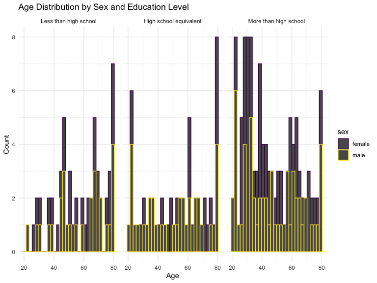
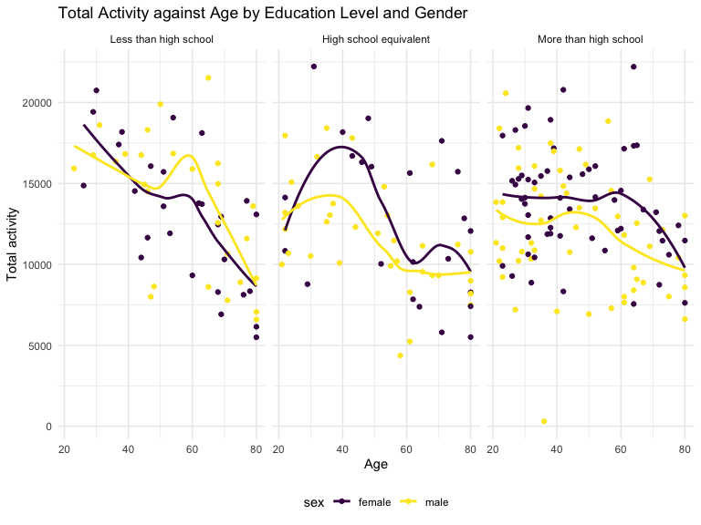
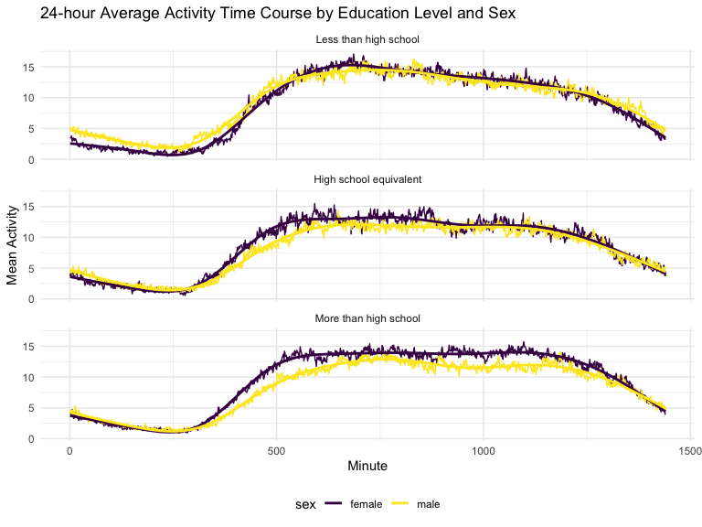
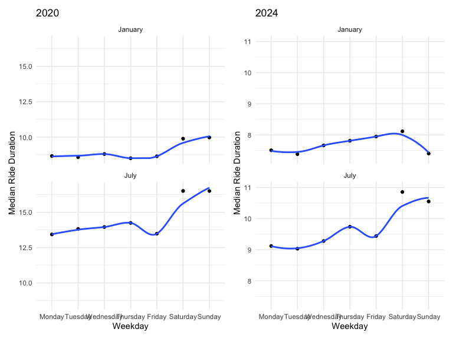
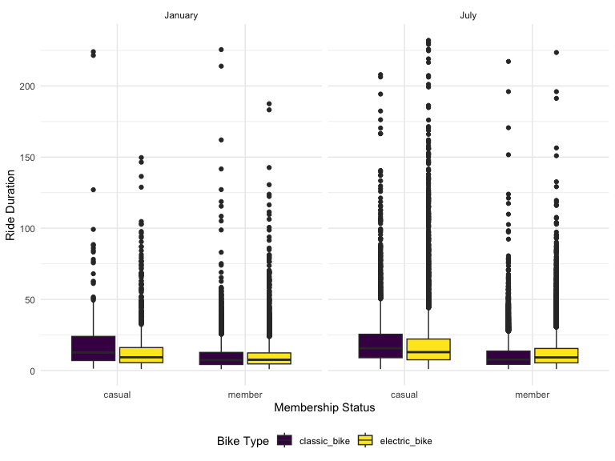

p8105_hw3_qh2285
================
Qianxuan Huang
2024-10-13

# problem 1

#### Read in the data

``` r
data("ny_noaa")
```

#### Answer questions about the data

This dataset contains 2595176 rows and 7 columns. Variables include
weather station id, date of observation, (tenths of mm), snowfall (mm),
snow depth (mm), and min and max temperature (tenths of degrees C).

Below we clean the data, creating separate variables for year, month,
and day and converting `tmax` and `tmin` to numeric. We find that 0 is
the most commonly observed value for snowfall. This is because most days
of the year, it does not snow at all in NY. The second most commonly
observed value is `NA`, indicating missingness. Other common values are
13, 25, and 51, suggesting that snowfall is originally recorded in
fractions of an inch and converted to mm.

``` r
ny_noaa %>% 
  count(snow) %>%
  arrange(desc(n))
```

    ## # A tibble: 282 × 2
    ##     snow       n
    ##    <int>   <int>
    ##  1     0 2008508
    ##  2    NA  381221
    ##  3    25   31022
    ##  4    13   23095
    ##  5    51   18274
    ##  6    76   10173
    ##  7     8    9962
    ##  8     5    9748
    ##  9    38    9197
    ## 10     3    8790
    ## # ℹ 272 more rows

``` r
ny_noaa = 
  ny_noaa %>% 
  separate(date, into = c("year", "month", "day"), convert = TRUE) %>% 
  mutate(
    tmax = as.numeric(tmax),
    tmin = as.numeric(tmin))
```

Below is a two-panel plot showing the average max temperature in January
and in July in each station across years. As expected, the mean
temperature in January is much lower than the mean temperature in July
for all stations and across all years. All stations appear to follow
similar trends of temperature peaks and valleys within a month across
the years, i.e. when one station has a high monthly mean temperature for
a given year, most other stations also have a high monthly mean
temperature for that year. We do see one uncharacteristically cold
station in July of 1987 or 1988, as well as a few other less drastic
outliers.

``` r
ny_noaa %>% 
  group_by(id, year, month) %>% 
  filter(month %in% c(1, 7)) %>% 
  summarize(mean_tmax = mean(tmax, na.rm = TRUE, color = id)) %>% 
  ggplot(aes(x = year, y = mean_tmax, group = id)) + geom_point() + geom_path() +
  facet_grid(~month) +
  labs(title = "Mean monthly temperature for each station across years for January and July")
```

    ## `summarise()` has grouped output by 'id', 'year'. You can override using the
    ## `.groups` argument.



Below we show a two-panel plot including (i) a hex plot of `tmax` vs
`tmin` for the full dataset; and (ii) a ridge plot showing the
distribution of snowfall values (in mm) greater than 0 and less than 100
separately by year.

From the hex plot we see that while there is some variability, the
majority of the data cluster tightly in the center of the distribution.
In relatively rare cases, it seems that `tmax` is less than `tmin`,
which raises questions about data recording and quality.

From the ridge plot, we see a multimodal density of snowfall within a
given year. Most stations see between 0 and 35 mm of snow in a year.
Then there is a another group of stations that see about 45 mm of snow,
and another group that sees nearly 80 mm. It is likely this
multimodality stems from the conversion of measurements in one system
(fractions of an inch) to another (using the metric system), which was
also noted in the table of common values.

``` r
hex = 
  ny_noaa %>% 
  ggplot(aes(x = tmin, y = tmax)) + 
  geom_hex()

ridge = 
  ny_noaa %>% 
  filter(snow < 100, snow > 0) %>%
  ggplot(aes(x = snow, y = as.factor(year))) + 
  geom_density_ridges()

hex + ridge
```

    ## Picking joint bandwidth of 3.76



# problem 2

Load and tidy data; exclude participants less than 21 years of age and
those with missing demographic data; encode data with reasonable
variable classes:

``` r
participants_df = #data start at row 4
    read_csv("./data/nhanes_covar.csv", na = c("NA", "", "."), skip = 4) |>
  janitor::clean_names() |> 
  mutate(sex = recode(sex, "1" = "male", "2" = "female"),
         education = recode(education, "1" = "Less than high school", 
                            "2" = "High school equivalent", 
                            "3" = "More than high school")) |>
  filter(age >= 21) |>
  drop_na()
```

    ## Rows: 250 Columns: 5
    ## ── Column specification ────────────────────────────────────────────────────────
    ## Delimiter: ","
    ## dbl (5): SEQN, sex, age, BMI, education
    ## 
    ## ℹ Use `spec()` to retrieve the full column specification for this data.
    ## ℹ Specify the column types or set `show_col_types = FALSE` to quiet this message.

``` r
accelerometer_df = 
  read_csv("./data/nhanes_accel.csv", na = c("NA", "", ".")) |>
  janitor::clean_names()
```

    ## Rows: 250 Columns: 1441
    ## ── Column specification ────────────────────────────────────────────────────────
    ## Delimiter: ","
    ## dbl (1441): SEQN, min1, min2, min3, min4, min5, min6, min7, min8, min9, min1...
    ## 
    ## ℹ Use `spec()` to retrieve the full column specification for this data.
    ## ℹ Specify the column types or set `show_col_types = FALSE` to quiet this message.

merge datasets:

``` r
final_df = participants_df |>
  left_join(accelerometer_df, by = "seqn")
```

reader-friendly table: number of men and women in each education
category:

``` r
final_df |>
  mutate(education = forcats::fct_relevel(education, c("Less than high school", "High school equivalent", "More than high school"))) |>
  janitor::tabyl(education, sex)
```

    ##               education female male
    ##   Less than high school     28   27
    ##  High school equivalent     23   35
    ##   More than high school     59   56

create a visualization of the age distributions for men and women in
each education category:

``` r
final_df |>
  mutate(education = forcats::fct_relevel(education, c("Less than high school", "High school equivalent", "More than high school"))) |>#change order
  ggplot(aes(x = age, color = sex)) +
  geom_histogram() +
  labs(title = "Age Distribution by Sex and Education Level",
       x = "Age", y = "Count") +
  theme_minimal() +
  facet_grid(. ~ education) #seperate graphs
```

    ## `stat_bin()` using `bins = 30`. Pick better value with `binwidth`.


For female, 28, 23, 59 people in Less than high school, High school
equivalent, More than high school; for male they are 27, 35,56. For
people in Less than high school group, distribution and number of female
and male are very similar. For people in High school equivalent group,
numb of male is bigger than female; and distribution is concentrated at
ages very old or young in both sex. For people in More than high school
group, number of female and male are very similar, both sex shown
left-skewed distribution.

Traditional analyses of accelerometer data focus on the total activity
over the day. Using your tidied dataset, aggregate across minutes to
create a total activity variable for each participant:

``` r
activity_df = final_df |>
  mutate(education = forcats::fct_relevel(education, c("Less than high school", "High school equivalent", "More than high school"))) |>
  rowwise() |>
  mutate(total_activity = sum(c_across(starts_with("min")))) |>
  select(!(starts_with("min")))
```

Plot these total activities (y-axis) against age (x-axis); your plot
should compare men to women and have separate panels for each education
level. Include a trend line or a smooth to illustrate differences:

``` r
ggplot(activity_df, aes(x = age, y = total_activity, color = sex)) +  
  geom_point() + 
  geom_smooth(se = FALSE) +
  facet_wrap(. ~ education) +  
  labs(title = "Total Activity against Age by Education Level and Gender",
       x = "Age", y = "Total activity")
```

    ## `geom_smooth()` using method = 'loess' and formula = 'y ~ x'


The total activity points don’t fit the curve at all because they are
too scattered. No trend can be concluded of total activity against age
by education level.

Accelerometer data allows the inspection activity over the course of the
day. Make a three-panel plot that shows the 24-hour activity time
courses for each education level and use color to indicate sex:

``` r
activity_summary = final_df |>
  mutate(education = forcats::fct_relevel(education, c("Less than high school", "High school equivalent", "More than high school"))) |>
  group_by(sex, education) |>
  summarise(across(starts_with("min"), mean, na.rm = TRUE))
```

    ## `summarise()` has grouped output by 'sex'. You can override using the `.groups`
    ## argument.

``` r
# Pivot the dataset to calculate mean of each min
activity_summary_long <- activity_summary |>
  pivot_longer(cols = starts_with("min"), 
               names_to = "minute", 
               names_prefix = "min", 
               values_to = "avg_activity") |>
  mutate(minute = as.numeric(minute))

ggplot(activity_summary_long, aes(x = minute, y = avg_activity, color = sex)) +
  geom_line() +  
  geom_smooth(se = FALSE) +  
  facet_wrap(. ~ education, ncol = 1) + 
  labs(title = "24-hour Average Activity Time Course by Education Level and Sex", x = "Minute", y = "Mean Activity") 
```

    ## `geom_smooth()` using method = 'gam' and formula = 'y ~ s(x, bs = "cs")'



Three education level shows same trends throughout the day that low
activity at night and increase in the morning. For High school
equivalent and More than high school group, female shows higher activity
level than male in general, but not in Less than high school group.

# problem 3

``` r
jan_2020 = 
    read_csv("./data/citibike/Jan 2020 Citi.csv", na = c("NA", "", ".")) |>
    janitor::clean_names() |>
    mutate(month = "January") |>
    mutate(year = 2020)
```

    ## Rows: 12420 Columns: 7
    ## ── Column specification ────────────────────────────────────────────────────────
    ## Delimiter: ","
    ## chr (6): ride_id, rideable_type, weekdays, start_station_name, end_station_n...
    ## dbl (1): duration
    ## 
    ## ℹ Use `spec()` to retrieve the full column specification for this data.
    ## ℹ Specify the column types or set `show_col_types = FALSE` to quiet this message.

``` r
jan_2024 = 
    read_csv("./data/citibike/Jan 2024 Citi.csv", na = c("NA", "", ".")) |>
    janitor::clean_names() |>
    mutate(month = "January") |>
    mutate(year = 2024)
```

    ## Rows: 18861 Columns: 7
    ## ── Column specification ────────────────────────────────────────────────────────
    ## Delimiter: ","
    ## chr (6): ride_id, rideable_type, weekdays, start_station_name, end_station_n...
    ## dbl (1): duration
    ## 
    ## ℹ Use `spec()` to retrieve the full column specification for this data.
    ## ℹ Specify the column types or set `show_col_types = FALSE` to quiet this message.

``` r
july_2020 = 
    read_csv("./data/citibike/July 2020 Citi.csv", na = c("NA", "", ".")) |>
    janitor::clean_names() |>
    mutate(month = "July") |>
    mutate(year = 2020)
```

    ## Rows: 21048 Columns: 7
    ## ── Column specification ────────────────────────────────────────────────────────
    ## Delimiter: ","
    ## chr (6): ride_id, rideable_type, weekdays, start_station_name, end_station_n...
    ## dbl (1): duration
    ## 
    ## ℹ Use `spec()` to retrieve the full column specification for this data.
    ## ℹ Specify the column types or set `show_col_types = FALSE` to quiet this message.

``` r
july_2024 = 
    read_csv("./data/citibike/July 2024 Citi.csv", na = c("NA", "", ".")) |>
    janitor::clean_names() |>
    mutate(month = "July") |>
    mutate(year = 2024)
```

    ## Rows: 47156 Columns: 7
    ## ── Column specification ────────────────────────────────────────────────────────
    ## Delimiter: ","
    ## chr (6): ride_id, rideable_type, weekdays, start_station_name, end_station_n...
    ## dbl (1): duration
    ## 
    ## ℹ Use `spec()` to retrieve the full column specification for this data.
    ## ℹ Specify the column types or set `show_col_types = FALSE` to quiet this message.

``` r
all_bike = bind_rows(jan_2020, jan_2024, july_2020, july_2024)
```

Produce a reader-friendly table showing the total number of rides in
each combination of year and month separating casual riders and Citi
Bike members:

``` r
janitor::tabyl(all_bike, year, month, member_casual)
```

    ## $casual
    ##  year January  July
    ##  2020     984  5637
    ##  2024    2108 10894
    ## 
    ## $member
    ##  year January  July
    ##  2020   11436 15411
    ##  2024   16753 36262

For casual riders, in 2020, 984 rides in January, and 5637 in July; in
2024, 2108 rides in January, and 10894 in July. For city bike member
riders, in 2020, 11436 rides in January, and 15411 in July; in 2024,
16753 rides in January, and 36262 in July.

Make a table showing the 5 most popular starting stations for July 2024;
include the number of rides originating from these stations:

``` r
top_starting = july_2024 |>
  group_by(start_station_name) |>
  summarise(total_rides = n()) |>
  arrange(desc(total_rides)) |>
  slice_head(n = 5) 
top_starting
```

    ## # A tibble: 5 × 2
    ##   start_station_name       total_rides
    ##   <chr>                          <int>
    ## 1 Pier 61 at Chelsea Piers         163
    ## 2 University Pl & E 14 St          155
    ## 3 W 21 St & 6 Ave                  152
    ## 4 West St & Chambers St            150
    ## 5 W 31 St & 7 Ave                  146

Make a plot to investigate the effects of day of the week, month, and
year on median ride duration. This plot can include one or more panels,
but should facilitate comparison across all variables of interest:

``` r
median_duration = all_bike |>
    mutate(weekdays = forcats::fct_relevel(weekdays, c("Monday", "Tuesday", "Wednesday", "Thursday", "Friday", "Saturday", "Sunday"))) |>
  group_by(year, month, weekdays) |>
  summarise(median_duration = median(duration, na.rm = TRUE))
```

    ## `summarise()` has grouped output by 'year', 'month'. You can override using the
    ## `.groups` argument.

``` r
(
  median_duration |> 
  filter(year == 2020) |> 
  group_by(month, weekdays) |>
  ggplot(aes(x = weekdays, y = median_duration, group = month, group = weekdays)) +  
  geom_point() +  
  geom_smooth(se = FALSE) +  
  facet_wrap(. ~ month, ncol = 1) +  
  labs(title = "2020", x = "Weekday", y = "Median Ride Duration") +
    ylim(8.5, 16.75)
) + # put 2 plots together
(
  median_duration |> 
  filter(year == 2024) |> 
  group_by(month, weekdays) |>
  ggplot(aes(x = weekdays, y = median_duration, group = month, group = weekdays)) +  
  geom_point() +  
  geom_smooth(se = FALSE) +  
  facet_wrap(. ~ month, ncol = 1) +  
  labs(title = "2024", x = "Weekday", y = "Median Ride Duration") +
    ylim(7.25, 11)
)
```

    ## `geom_smooth()` using method = 'loess' and formula = 'y ~ x'
    ## `geom_smooth()` using method = 'loess' and formula = 'y ~ x'


Comparing between January and July: Median ride duration in July in both
year are higher than January, and shows similar trends for weekdays.
Especially in July that duration time drop in Friday, the trend keep
increase throughout the week otherwise. Comparing between 2020 and 2024:
Median ride duration time are generally much higher in 2020.

For data in 2024, make a figure that shows the impact of month,
membership status, and bike type on the distribution of ride duration:

``` r
all_2024 = bind_rows(jan_2024, july_2024)

all_2024 |>
  group_by(month, member_casual, rideable_type) |>
  ggplot(aes(x = member_casual, y = duration, fill = rideable_type)) +
  geom_boxplot() + 
  facet_wrap(~ month) + 
  labs(x = "Membership Status", y = "Ride Duration", fill = "Bike Type") 
```


According to the box plot, all groups have long tails in long-time ride
duration from about 25 to 250. For casual riders, they ride classic bike
for a longer time; for city bike members, they ride electric bike for a
longer time. Duration of city bike members are more concentrated in
shorter time. January and July show similar distribution, wile duration
in July is slightly longer.
